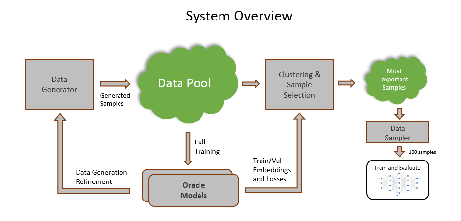

# ITU-ML5G-PS-002-GhostDucks-GNNetworking-Challenge2022
This repository contains the code and description of team Ghost Ducks solution to the [GNN Networking Challenge 2022](https://bnn.upc.edu/challenge/gnnet2022/) - Improving Network Digital Twins through Data-centric AI.



* solution_description.pdf - contains the solution details
* run_instructions.pdf - contains detailed instructions how to run the code
* solution_slides.pdf - contains the presentation slides

## Requirements

We used python 3.9 on Linux Ubuntu environment.
The requirements are listed in the following files:

* requirements.txt – the packages specification

* requirements.conda.txt – contains full list of packages extracted by "conda list"

* requirements.pip.txt – contains full list of packages extracted by "pip freeze"

## Directory Structure

Our code is based on the challenge's [GitHub repository](https://github.com/BNN-UPC/GNNetworkingChallenge/tree/2022_DataCentricAI). We made a few changes to the original files in order to speed up the data loading process by providing pickle data generator. We also made a small modification to the RouteNet model so that it would have an option of returning internal features.


## Additional Resources

In addition to the code, we provide for [download here](https://www.dropbox.com/s/ccamrf500cf6rmw/gducks_additional_data.tar?dl=0) a tar file with the following artifacts:

generated_datasets/ - all the samples we generated (~270K) with both the input to simulator and its outputs

generated_datasets_pkl/ - all the generated samples in pickle format, each holding RouteNet input structure

validation_dataset/ - the validation data as provided in the challenge

validation_dataset_pkl/ - the validation data converted to pickle format, each holding RouteNet input structure

oracle_models/ - the two oracle models we used to cluster the training samples. Each model's subdirectory contains the training logs, the best checkpoint, embedding files for all samples and sample losses measured by the model on all the samples.

best_submission/ - contains the submission which got us the best result, including its original setup and pickle files list

**Notes:**

- If using our provided models and data, place them each at its appropriate location in this tree. For example, place the contents of _generated\_samples\_pkl/_ from our package into the directory _generated\_samples\_pkl/_ in the source tree.
- If not using our provided models and data, and generating everything from scratch, keep these placeholder directories empty. The given instructions should generate their outputs at these locations.
- Throughout this document we refer to the root of directory structure as **$src**. If using Linux bash it can be set via ```export src=/path/to/sources/root```. In addition, in the provided bash scripts, update **$src** variable so that it points at the correct location.
- If using our provided models and data, you can skip most of this document and go directly to section "3. Clustering and Sampling".
- Add _$src_ to your _PYTHONPATH_ environment variable, to prevent import problems (e.g. ```export PYTHONPATH=$src:$PYTHONPATH``` if using Linux bash).

## 1. Generating the datasets

We generated our dataset incrementally, trying out different configurations.  
The data generation parameters and different configurations are located under _config/datagen_ in the yaml files. These files specify topology creation, routing, link bandwidth, buffer sizes, types of queues, packet size, timing distributions, etc.  
For generating data, we use [Hydra](https://hydra.cc/) configuration management library to mix and match different configuration options at the command line.  
Our data is broken into twenty-eight sub-datasets, each generated from a particular distribution. It is worth noting that each generated data folder contains a _.hydra/config.yaml_ file. This file lists all the parameters used to generate samples in that specific folder.

### 1.1 Generating input data for OMNet

All the datasets can be generated by running **datagen/generate\_all.sh**.
This is a bash script that runs our data generation tool several times and creates multiple dataset directories. The script invokes python, so it expects the right python environment to be set.

**Before running the script, edit it to replace variable "src" at the beginning of the script to point to the base of the code tree.**

```
% chmod +x $src/datagen/generate_all.sh
% $src/datagen/generate_all.sh
```

After the script is finished, you will find the dataset folders under _generated\_datasets/_ directory.

### 1.2 Running OMNet

After generate_all.sh completes, OMNet needs to be run on all the directories to generate simulation results. This step is described in detail in the challenge description. Please refer to the [GNNetChallenge2022](https://github.com/BNN-UPC/GNNetworkingChallenge/tree/2022_DataCentricAI) repo.

### 1.3 Converting to pickle format

After OMNet simulation completes, we run _RouteNet\_utils/data\_utils.py_ to create pickle files from the generated data that contain RouteNet compatible input of all samples. This speeds up the data loading process during the validation and training steps. The input to this script should be the top level directory containing a dataset. The script recursively finds all the generated samples and creates a similar directory tree in the target directory which contains a separate pickle file for each sample.

```
python $src/RouteNet_utils/data_utils.py --input_data_dir $src/generated_datasets --output_data_dir $src/generated_datasets_pkl
```

The same process needs to be repeated also for the validation dataset:
```
python $src/RouteNet_utils/data_utils.py --input_data_dir $src/validation_dataset --output_data_dir $src/validation_dataset_pkl
```

After these steps, the directory structure in _generated\_datasets\_pkl_ and _validation\_dataset\_pkl_ should resemble the structure in the original data directories. With a pickle file for every sample, replacing the original tar.gz.

## 2. Creating Oracle Models

We provide two trained oracle models that were used for the final submission. We also provide the sample losses and embeddings extracted using these oracles. Below are the steps to reproduce the oracles, losses and embeddings.

### 2.1 Training the Oracles

The oracles can be trained using the provided scripts _train\_oracle\_589.sh_ and _train\_oracle\_615.sh_. Since the oracle is trained only on a subset of the entire dataset, each of these scripts will copy the relevant data subset into the training directory (see the script for exact subset specification).

**Before running the scripts, edit and modify the variable $src inside the script to point to the code root directory.**

```
% chmod +x $src/train_oracle_589.sh

% $src/train_oracle_589.sh

% chmod +x $src/train_oracle_615.sh

% $src/train_oracle_615.sh

```

The oracle models are saved to _$src/oracle\_models/_.

### 2.2 Extracting sample losses and embeddings

After the oracle is trained we use it to extract losses and embeddings for each of the samples in the validation and training datasets. They will be used in later steps.

To extract these using an oracle checkpoint run _oracle\_setup.py_ script once for validation set and once for all the generated samples. For 6.15 oracle, run from _$src/oracle\_models/6.15_ the following commands (assuming the best checkpoint is _43-6.15.index):

```
# for validation samples:
python $src/oracle_setup.py -ckpt <path/to/modelCheckpoints/43-6.15> -name val -data $src/validation_dataset_pkl -o .

# for generated samples:
python $src/oracle_setup.py -ckpt <path/to/modelCheckpoints/43-6.15> -name train -data $src/generated_datasets_pkl -o .
```

Note that **the checkpoint name is given without the .index suffix**. Also note that this step may take long time to process all the samples.

After the above two commands, the script should have created the following files under the target (_-o_) directory:

```
# Embeddings:
sample_embeddings_43-6.15/val_min_max_mean.pkl
sample_embeddings_43-6.15/train_min_max_mean.pkl

# csv files containing losses for each sample:
eval/val_sample_loss_43-6.15.csv
eval/train_sample_loss_43-6.15.csv
```

Run a similar command from _$src/oracle\_models/5.89 with the appropriate checkpoint to generate similar files for the second oracle. (Both are necessary for next steps)_


## 3. Clustering and Sampling 100-sample subsets

As described in the solution document, given the oracle embeddings and validation losses, our code clusters the generated samples into several groups. Then it selects the top-k samples from each group, after which it chooses 100 samples from the selected sub-groups.

The script _$src/random\_train/clustering\_train.py_ generates multiple sets of 100 samples from the cluster pool. It can also be used to train each of the sets after sampling. The following creates a subdirectory for each sampled set, with file _sample.txt_ that holds the list of the chosen pickle samples:

```
python $src/random_train/clustering_train.py --n_trainings <#sampled sets> -d $src/generated_datasets_pkl --save_path <path_to_output_dir> --embed_dir $src/oracle_models/6.15/sample_embeddings_xxxxx $src/oracle_models/5.89/sample_embeddings_xxxxx
```

**Replace above sample\_embeddings\_xxxxx with the correct directory name containing the embeddings.  
The save_path parameter should include the full path, e.g., $src/random\_sets**

_Note - If using the data, oracles and embedding files that we provided, the clustering algorithm generates from the 270K samples a small sampling pool of 401 samples divided into 88 groups. For reference, this pool is saved in the output directory as file "topk\_samples\_pool.pkl". User can verify that the 100 samples from our best submission are contained in this pool._

In order to also train on each set and evaluate the results, the following command can be used:

```
python $src/random_train/clustering_train.py --train True --n_trainings <#sampled sets> -d $src/generated_datasets_pkl -t $src/validation_dataset_pkl --save_path <path_to_output_dir> --embed_dir $src/oracle_models/6.15/sample_embeddings_xxxxx $src/oracle_models/5.89/sample_embeddings_xxxxx -w_train \<#train_cpu_workers\> -w_val <#val_cpu_workers> -–ngpus_val <#gpus> --ckpt_weights_dir $src/RouteNet_Fermi/initial_weights/initial_weights
```

In this case, the script will launch a number of parallel workers as specified – each for a different experiment. If _ngpus_val_ is specified and its value is greater than 0, the script will run validation on the available GPUs.

In order to collect the results from all the experiments, the following python snippet can be used:

```
from random_train.utils import get_eval_loss_multi
res_df = get_eval_loss_multi(<results_dir>)
```

It returns a pandas data-frame, where each row describes a single experiment with the following information: loss per epoch, final loss, best loss, best epoch, data directory name and full path of data directory.


-----
For more information about the this challenge go to: https://bnn.upc.edu/challenge/gnnet2022/

For more information about the ITU AI/ML in 5G Challenge go to: https://aiforgood.itu.int/about-ai-for-good/aiml-in-5g-challenge/

